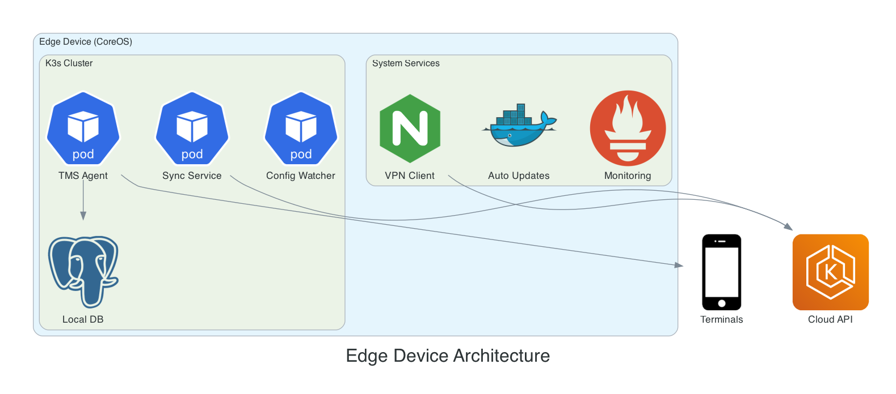
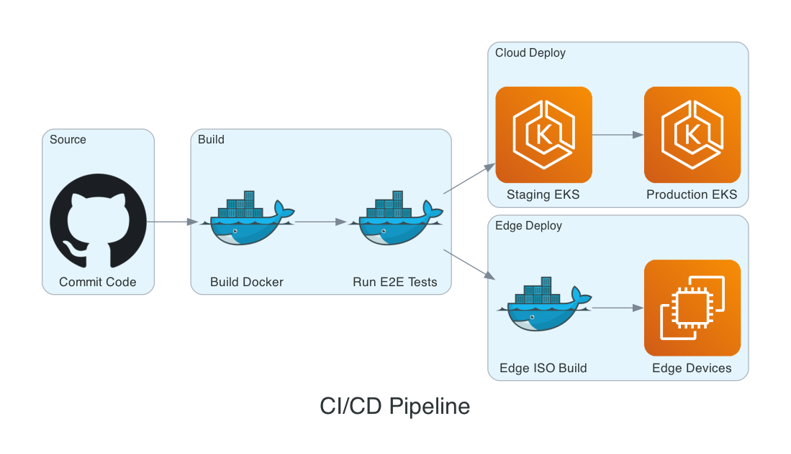

# Hybrid Edge-Cloud Terminal Management System

## Project Overview

**Client:** ChaiOne Inc.  
**Location:** Houston, TX, USA (Remote)  
**Duration:** May 2022 - April 2024  
**Role:** DevOps Architect (Freelance)

---

## Executive Summary

Architected and implemented a sophisticated hybrid deployment infrastructure for a Terminal Management System (TMS) serving industrial facilities. The solution seamlessly integrates on-premises edge devices with cloud-based infrastructure, enabling reliable operations even in disconnected scenarios while leveraging cloud scalability for centralized management and analytics.

---

## Business Challenge

The client needed a Terminal Management System for industrial facilities with unique requirements:

- **Unreliable connectivity** - Edge locations often have intermittent internet
- **Low latency requirements** - Terminal operations need sub-second response times
- **Centralized management** - Need to manage hundreds of edge devices from cloud
- **Security compliance** - Industrial facilities require strict security controls
- **Scalability** - Solution must scale to thousands of terminals across facilities

---

## Solution Architecture

### Architecture Diagram


---

## Technical Implementation

### 1. Cloud Infrastructure (AWS)

**Infrastructure as Code with Terraform:**

```
aws-infrastructure/
├── modules/
│   ├── vpc/                    # VPC with public/private subnets
│   ├── eks/                    # EKS cluster configuration
│   ├── rds/                    # PostgreSQL database
│   ├── s3-cloudfront/          # Static asset delivery
│   ├── vpn-gateway/            # Site-to-site VPN
│   └── ecr/                    # Container registry
├── environments/
│   ├── dev/
│   ├── staging/
│   └── production/
└── terraform.tfvars
```

**AWS Services Utilized:**
| Service | Purpose |
|---------|---------|
| EKS | Kubernetes control plane for cloud services |
| EC2 | Worker nodes for EKS cluster |
| RDS | PostgreSQL database for centralized data |
| S3 | Static assets and configuration storage |
| CloudFront | Global CDN for low-latency asset delivery |
| VPN Gateway | Secure connectivity to edge locations |
| ECR | Container image registry |

### 2. Edge Device Architecture



**Key Features:**
- **Immutable OS** - CoreOS with OSTree for atomic updates
- **Lightweight Kubernetes** - K3s for resource-constrained devices
- **Offline-first** - Local database for operation during disconnection
- **Auto-sync** - Automatic synchronization when connectivity restored
- **Remote management** - OTA updates and configuration changes

### 3. Helm Charts for TMS Application

**Cloud Components:**
```yaml
# values-cloud.yaml
replicaCount: 3
image:
  repository: <account>.dkr.ecr.us-east-1.amazonaws.com/tms-api
  tag: "1.0.0"
resources:
  requests:
    memory: "256Mi"
    cpu: "250m"
  limits:
    memory: "512Mi"
    cpu: "500m"
ingress:
  enabled: true
  annotations:
    kubernetes.io/ingress.class: alb
```

**Edge Components:**
```yaml
# values-edge.yaml
replicaCount: 1
image:
  repository: <account>.dkr.ecr.us-east-1.amazonaws.com/tms-agent
  tag: "1.0.0"
resources:
  requests:
    memory: "128Mi"
    cpu: "100m"
  limits:
    memory: "256Mi"
    cpu: "200m"
persistence:
  enabled: true
  size: 10Gi
```

### 4. CI/CD Pipeline (Azure DevOps)



### 5. IoT Application Infrastructure

Separate Terraform modules for IoT workloads:
- AWS IoT Core for device connectivity
- Kinesis for real-time data streaming
- Lambda for event processing
- DynamoDB for device state management

---

## Key Achievements

| Metric | Result |
|--------|--------|
| Edge Devices Deployed | 50+ locations |
| Uptime (Edge) | 99.9% availability |
| Offline Operation | Up to 72 hours |
| Sync Recovery Time | < 5 minutes |
| Deployment Time (New Edge) | 15 minutes |
| Infrastructure Cost Reduction | 35% vs traditional approach |

---

## Technologies Used

**Cloud (AWS):**
- EKS, EC2, VPC, RDS PostgreSQL
- S3, CloudFront, ECR
- VPN Gateway, Route 53
- IoT Core, Kinesis, Lambda

**Edge:**
- CoreOS (Fedora CoreOS)
- K3s (Lightweight Kubernetes)
- SQLite (Local database)

**Infrastructure as Code:**
- Terraform
- Helm Charts

**CI/CD:**
- Azure DevOps Pipelines
- Docker, Container Registry

---

## Unique Challenges Solved

### 1. Offline-First Architecture
Designed edge applications to operate fully offline, queuing operations and syncing when connectivity is restored.

### 2. Secure Remote Updates
Implemented OTA update mechanism using CoreOS OSTree, allowing atomic rollbacks if updates fail.

### 3. Certificate Management
Automated certificate provisioning and rotation for edge devices connecting via VPN.

### 4. Resource Optimization
Optimized K3s and container footprint to run on limited edge hardware (4GB RAM, 2 CPU cores).

---

## Sample Deliverables

1. **Terraform Modules** - Complete AWS infrastructure automation
2. **CoreOS ISO Builder** - Automated edge device image creation
3. **Helm Charts** - Cloud and edge application deployment
4. **Azure DevOps Pipelines** - Complete CI/CD workflow
5. **Architecture Documentation** - Detailed system design docs
6. **Runbooks** - Operational procedures for edge device management

---

## Contact

**Available for similar projects involving:**
- Hybrid cloud/edge architectures
- IoT platform infrastructure
- AWS infrastructure design and implementation
- Kubernetes at the edge (K3s, K0s)
- Site-to-site VPN and secure networking
- CI/CD pipeline implementation
