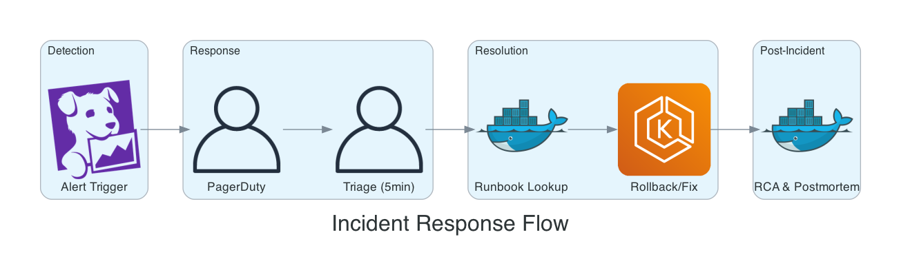

# High-Scale SRE: edX Learning Platform

## Project Overview

**Client:** edX LLC (acquired by 2U)  
**Location:** Massachusetts, USA (Remote)  
**Duration:** May 2021 - May 2022  
**Role:** Site Reliability Engineer

---

## Executive Summary

Served as Site Reliability Engineer for edX, one of the world's largest online learning platforms serving millions of learners globally. Managed AWS infrastructure for 50+ microservices, led critical migrations from legacy infrastructure to Kubernetes, and maintained platform reliability through on-call rotations and incident response.

---

## Platform Scale

The edX platform serves 50M+ learners globally with 50+ microservices, 24/7 availability, and partnerships with Harvard, MIT, Microsoft, and 200+ other institutions.

---

## Infrastructure Architecture

### Architecture Diagrams


---

## Key Responsibilities

### 1. Infrastructure Management

**Terraform Infrastructure as Code:**

```
edx-infrastructure/
├── terraform/
│   ├── modules/
│   │   ├── eks-cluster/
│   │   ├── rds-mysql/
│   │   ├── elasticache/
│   │   ├── elasticsearch/
│   │   ├── s3-cdn/
│   │   └── networking/
│   ├── environments/
│   │   ├── production/
│   │   ├── staging/
│   │   └── sandbox/
│   └── imports/           # Legacy infrastructure imports
└── helm-charts/
    ├── lms/
    ├── cms/
    └── microservices/
```

**AWS Services Managed:**
| Service | Scale | Purpose |
|---------|-------|---------|
| EKS | 100+ nodes | Kubernetes orchestration |
| RDS MySQL | Multi-AZ, Read Replicas | Primary database |
| ElastiCache | Redis cluster | Session & caching |
| Elasticsearch | 50+ node cluster | Course search & analytics |
| S3 + CloudFront | Petabytes | Video & asset delivery |
| EC2 ASG | Legacy services | Migration source |

### 2. Legacy to Kubernetes Migration

The migration followed a phased approach:
1. **Assessment** - Analyze EC2 service architecture, document dependencies
2. **Containerization** - Create Dockerfile, Helm chart with resource limits
3. **Parallel Deployment** - Deploy to EKS alongside EC2, traffic splitting (10% → 50% → 100%)
4. **Cutover** - Full traffic to EKS, decommission EC2 instances

### 3. GitOps with ArgoCD

```yaml
# Example ArgoCD Application
apiVersion: argoproj.io/v1alpha1
kind: Application
metadata:
  name: lms-production
  namespace: argocd
spec:
  project: edx-production
  source:
    repoURL: https://github.com/edx/helm-charts
    path: lms
    targetRevision: HEAD
    helm:
      valueFiles:
        - values-production.yaml
  destination:
    server: https://kubernetes.default.svc
    namespace: lms
  syncPolicy:
    automated:
      prune: true
      selfHeal: true
```

### 4. On-Call & Incident Response



**Incident Categories Handled:**
- Database performance degradation
- Service outages and cascading failures
- CDN and cache issues
- Authentication system problems
- High traffic events (course launches, enrollment periods)

### 5. Automation Scripts

**Python Automation Examples:**

```python
# Example: Automated stale resource cleanup
import boto3
from datetime import datetime, timedelta

def cleanup_stale_ebs_snapshots(days_old=90):
    """Remove EBS snapshots older than specified days"""
    ec2 = boto3.client('ec2')
    cutoff = datetime.now() - timedelta(days=days_old)
    
    snapshots = ec2.describe_snapshots(OwnerIds=['self'])
    for snapshot in snapshots['Snapshots']:
        if snapshot['StartTime'].replace(tzinfo=None) < cutoff:
            ec2.delete_snapshot(SnapshotId=snapshot['SnapshotId'])
            print(f"Deleted snapshot: {snapshot['SnapshotId']}")

# Example: Health check automation
def check_service_health(services):
    """Check health endpoints for all services"""
    results = {}
    for service, endpoint in services.items():
        response = requests.get(f"{endpoint}/health", timeout=10)
        results[service] = {
            'status': response.status_code,
            'latency_ms': response.elapsed.total_seconds() * 1000
        }
    return results
```

---

## Key Achievements

| Metric | Achievement |
|--------|-------------|
| Services Migrated | 15+ services from EC2 to EKS |
| Infrastructure Coverage | 95% managed via Terraform |
| Incident Response | < 15 min MTTA (Mean Time To Acknowledge) |
| Cost Optimization | Identified $50K+ monthly savings opportunities |
| Automation Scripts | 20+ Python scripts for maintenance tasks |
| Documentation | 50+ runbooks and troubleshooting guides |

---

## Technologies Used

**Cloud (AWS):**
- EKS, EC2, ASG, Lambda
- RDS MySQL, ElastiCache Redis
- Elasticsearch Service
- S3, CloudFront, Route53
- IAM, KMS, Secrets Manager

**Infrastructure as Code:**
- Terraform
- Helm Charts
- ArgoCD

**Monitoring & Observability:**
- New Relic
- PagerDuty
- CloudWatch
- Elasticsearch + Kibana

**Programming:**
- Python (automation scripts)
- Bash (operational scripts)

---

## SRE Practices Implemented

### Service Level Objectives (SLOs)

| Service | SLO Target | Metric |
|---------|------------|--------|
| LMS Availability | 99.9% | Uptime |
| API Latency (p99) | < 500ms | Response time |
| Course Video Delivery | 99.95% | CDN availability |
| Authentication | 99.99% | Login success rate |

### Reliability Practices

1. **Error Budgets** - Tracked remaining error budget for deployment decisions
2. **Blameless Postmortems** - Documented learnings from every incident
3. **Capacity Planning** - Quarterly reviews of resource utilization
4. **Chaos Engineering** - Participated in game days testing failure scenarios

---

## Sample Deliverables

1. **Terraform Modules** - Reusable AWS infrastructure components
2. **Helm Charts** - Kubernetes deployment configurations
3. **Runbooks** - Operational documentation for on-call
4. **Python Scripts** - Automation for maintenance tasks
5. **Migration Plans** - EC2 to EKS migration documentation
6. **Postmortem Templates** - Incident analysis frameworks

---

## Contact

**Available for similar projects involving:**
- Large-scale AWS infrastructure management
- Site Reliability Engineering practices
- Kubernetes migrations from legacy infrastructure
- Terraform infrastructure as code
- On-call processes and incident response
- Python automation for DevOps
