# Internal Developer Platform - Architecture Diagram

## Mermaid Diagram (Copy to mermaid.live or any Mermaid editor)

```mermaid
flowchart TB
    subgraph "Developer Experience"
        DEV[👨‍💻 Developer]
        GIT[GitLab Repository]
        PORTAL[Backstage Portal]
    end

    subgraph "CI/CD Pipeline"
        GITLAB[GitLab CI/CD]
        ATLANTIS[Atlantis IaC]
        ARGOCD[ArgoCD GitOps]
    end

    subgraph "Azure Kubernetes Service"
        subgraph "Platform Services"
            VAULT[HashiCorp Vault]
            PROM[Prometheus Stack]
            EXTDNS[External DNS]
            CERT[Cert Manager]
        end
        
        subgraph "Application Namespaces"
            DEV_NS[Dev Namespace]
            STG_NS[Staging Namespace]
            PROD_NS[Production Namespace]
        end
    end

    subgraph "Azure Cloud Services"
        STORAGE[Azure Storage]
        POSTGRES[Azure PostgreSQL]
        REDIS[Azure Redis Cache]
        AAD[Azure AD]
    end

    DEV --> GIT
    DEV --> PORTAL
    GIT --> GITLAB
    GITLAB --> ARGOCD
    GITLAB --> ATLANTIS
    ATLANTIS --> STORAGE
    ATLANTIS --> POSTGRES
    ATLANTIS --> REDIS
    ARGOCD --> DEV_NS
    ARGOCD --> STG_NS
    ARGOCD --> PROD_NS
    VAULT --> DEV_NS
    VAULT --> STG_NS
    VAULT --> PROD_NS
    AAD --> VAULT
    PROM --> DEV_NS
    PROM --> STG_NS
    PROM --> PROD_NS
```



---

## Draw.io Compatible XML (Import into draw.io)

Save this as `idp-architecture.drawio`:

```xml
<mxfile>
  <diagram name="IDP Architecture">
    <mxGraphModel dx="1200" dy="800" grid="1" gridSize="10">
      <root>
        <mxCell id="0"/>
        <mxCell id="1" parent="0"/>
        
        <!-- Developer Layer -->
        <mxCell id="dev-layer" value="Developer Experience" style="swimlane;fillColor=#dae8fc;strokeColor=#6c8ebf;" vertex="1" parent="1">
          <mxGeometry x="40" y="40" width="300" height="120" as="geometry"/>
        </mxCell>
        
        <!-- CI/CD Layer -->
        <mxCell id="cicd-layer" value="CI/CD Pipeline" style="swimlane;fillColor=#d5e8d4;strokeColor=#82b366;" vertex="1" parent="1">
          <mxGeometry x="40" y="180" width="300" height="120" as="geometry"/>
        </mxCell>
        
        <!-- Kubernetes Layer -->
        <mxCell id="k8s-layer" value="Azure Kubernetes Service" style="swimlane;fillColor=#ffe6cc;strokeColor=#d79b00;" vertex="1" parent="1">
          <mxGeometry x="40" y="320" width="600" height="200" as="geometry"/>
        </mxCell>
        
        <!-- Azure Services Layer -->
        <mxCell id="azure-layer" value="Azure Cloud Services" style="swimlane;fillColor=#e1d5e7;strokeColor=#9673a6;" vertex="1" parent="1">
          <mxGeometry x="40" y="540" width="600" height="100" as="geometry"/>
        </mxCell>
        
      </root>
    </mxGraphModel>
  </diagram>
</mxfile>
```

---

## PlantUML Diagram

```plantuml
@startuml Internal Developer Platform

!define AzurePuml https://raw.githubusercontent.com/plantuml-stdlib/Azure-PlantUML/master/dist
!includeurl AzurePuml/AzureCommon.puml

skinparam backgroundColor #FFFFFF
skinparam componentStyle rectangle

package "Developer Experience" {
    actor Developer
    component "GitLab\nRepository" as Git
    component "Backstage\nPortal" as Portal
}

package "CI/CD Pipeline" {
    component "GitLab CI/CD" as GitLabCI
    component "Atlantis\n(IaC)" as Atlantis
    component "ArgoCD\n(GitOps)" as ArgoCD
}

package "Azure Kubernetes Service" {
    package "Platform Services" {
        component "HashiCorp Vault" as Vault
        component "Prometheus Stack" as Prom
        component "External DNS" as ExtDNS
        component "Cert Manager" as CertMgr
    }
    
    package "Application Namespaces" {
        component "Dev" as DevNS
        component "Staging" as StgNS
        component "Production" as ProdNS
    }
}

package "Azure Cloud Services" {
    database "Azure Storage" as Storage
    database "PostgreSQL" as Postgres
    database "Redis Cache" as Redis
    component "Azure AD" as AAD
}

Developer --> Git
Developer --> Portal
Git --> GitLabCI
GitLabCI --> ArgoCD
GitLabCI --> Atlantis
Atlantis --> Storage
Atlantis --> Postgres
Atlantis --> Redis
ArgoCD --> DevNS
ArgoCD --> StgNS
ArgoCD --> ProdNS
Vault --> DevNS
Vault --> StgNS
Vault --> ProdNS
AAD --> Vault

@enduml
```

---

## Lucidchart/Figma Description

**Layers (Top to Bottom):**

1. **Developer Experience Layer** (Blue)
   - Developer icon
   - GitLab Repository
   - Backstage Portal

2. **CI/CD Pipeline Layer** (Green)
   - GitLab CI/CD (build & test)
   - Atlantis (Infrastructure changes)
   - ArgoCD (Application deployment)

3. **Kubernetes Platform Layer** (Orange)
   - Platform Services: Vault, Prometheus, External DNS, Cert Manager
   - Namespaces: Dev, Staging, Production

4. **Azure Services Layer** (Purple)
   - Azure Storage Accounts
   - Azure PostgreSQL
   - Azure Redis Cache
   - Azure Active Directory

**Connections:**
- Developer → GitLab (code push)
- GitLab CI → Atlantis (IaC changes)
- GitLab CI → ArgoCD (app deployment)
- ArgoCD → Kubernetes Namespaces
- Atlantis → Azure Services
- Vault → All Namespaces (secrets injection)
