# Hybrid Edge-Cloud Architecture - Diagram

## Mermaid Diagram

```mermaid
flowchart TB
    subgraph "AWS Cloud Region"
        subgraph "Control Plane - EKS"
            API[TMS API Gateway]
            ANALYTICS[Analytics Service]
            REGISTRY[Device Registry]
            CONFIG[Config Manager]
        end
        
        subgraph "AWS Services"
            CF[CloudFront CDN]
            S3[S3 Storage]
            RDS[(RDS PostgreSQL)]
            ECR[ECR Registry]
        end
        
        VPN[AWS VPN Gateway]
    end

    subgraph "Edge Location A"
        subgraph "Edge Device A - CoreOS"
            K3S_A[K3s Cluster]
            AGENT_A[TMS Agent]
            LOCALDB_A[(Local SQLite)]
        end
        TERMINALS_A[🖥️ Terminals]
    end

    subgraph "Edge Location B"
        subgraph "Edge Device B - CoreOS"
            K3S_B[K3s Cluster]
            AGENT_B[TMS Agent]
            LOCALDB_B[(Local SQLite)]
        end
        TERMINALS_B[🖥️ Terminals]
    end

    subgraph "Edge Location N"
        subgraph "Edge Device N - CoreOS"
            K3S_N[K3s Cluster]
            AGENT_N[TMS Agent]
            LOCALDB_N[(Local SQLite)]
        end
        TERMINALS_N[🖥️ Terminals]
    end

    API --> RDS
    API --> S3
    CF --> S3
    
    VPN -.->|Site-to-Site VPN| K3S_A
    VPN -.->|Site-to-Site VPN| K3S_B
    VPN -.->|Site-to-Site VPN| K3S_N
    
    AGENT_A --> LOCALDB_A
    AGENT_B --> LOCALDB_B
    AGENT_N --> LOCALDB_N
    
    K3S_A --> TERMINALS_A
    K3S_B --> TERMINALS_B
    K3S_N --> TERMINALS_N
    
    AGENT_A -.->|Sync when connected| API
    AGENT_B -.->|Sync when connected| API
    AGENT_N -.->|Sync when connected| API
```

---

## PlantUML Diagram

---

## Data Flow Diagram

---

## Component Details for Design Tools

### Cloud Layer Components:
| Component | Icon | Description |
|-----------|------|-------------|
| EKS Cluster | AWS EKS icon | Kubernetes control plane |
| RDS PostgreSQL | Database icon | Central database |
| S3 | Storage bucket icon | Asset storage |
| CloudFront | CDN icon | Content delivery |
| VPN Gateway | Network icon | Secure tunnel endpoint |
| ECR | Container icon | Docker registry |

### Edge Layer Components:
| Component | Icon | Description |
|-----------|------|-------------|
| CoreOS | Server icon | Immutable Linux OS |
| K3s | Kubernetes icon (small) | Lightweight K8s |
| TMS Agent | Application icon | Main edge application |
| SQLite | Database icon (small) | Local persistence |
| Terminals | Monitor icons | End-user devices |

### Connection Types:
| Connection | Style | Description |
|------------|-------|-------------|
| VPN Tunnel | Dashed line | Encrypted tunnel |
| Data Flow | Solid arrow | Direct communication |
| Sync | Dotted arrow | Periodic synchronization |
