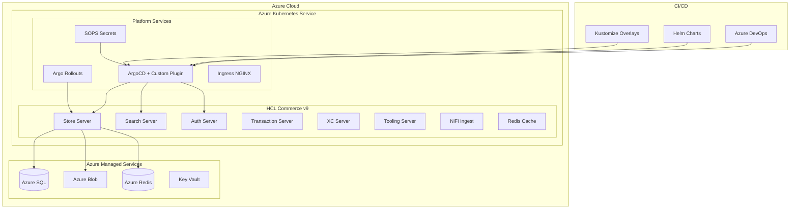
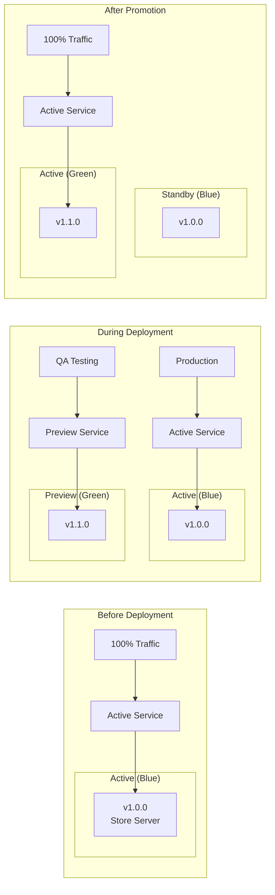
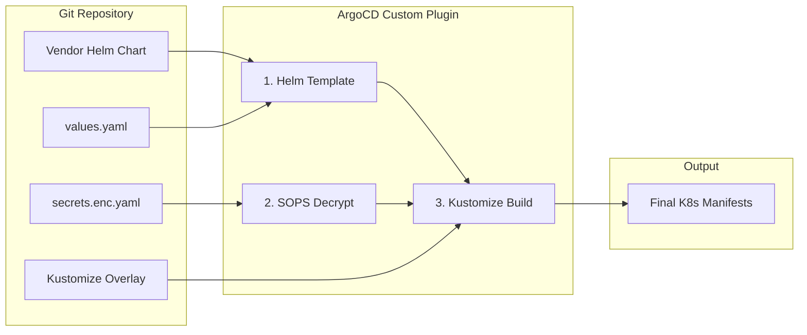
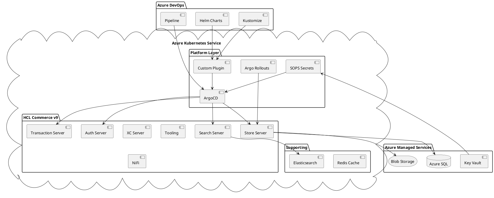
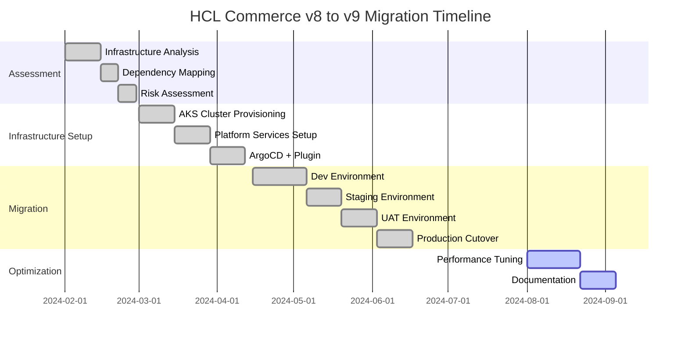
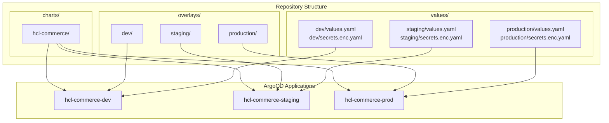

# HCL Commerce Kubernetes Migration - Diagram

## Mermaid Diagram - Overall Architecture

---

## Blue-Green Deployment Flow

---

## Custom ArgoCD Plugin Flow

---

## PlantUML Diagram

---

## Migration Phases Diagram

---

## Environment Configuration Structure

---

## Component Descriptions for Design Tools

### AKS Components:
| Component | Purpose | Replicas |
|-----------|---------|----------|
| Store Server | Customer-facing storefront | 3-6 |
| Search Server | Product search (Elasticsearch) | 2-4 |
| Auth Server | Authentication & sessions | 2-3 |
| Transaction Server | Order processing | 2-4 |
| XC Server | Extended catalog | 2 |
| Tooling Server | Admin tools | 1-2 |
| NiFi | Data ingestion | 1-2 |

### Platform Components:
| Component | Purpose |
|-----------|---------|
| ArgoCD | GitOps deployment |
| Custom Plugin | Helm + Kustomize integration |
| SOPS | Encrypted secrets |
| Argo Rollouts | Blue-Green deployments |
| Ingress NGINX | Traffic routing |
