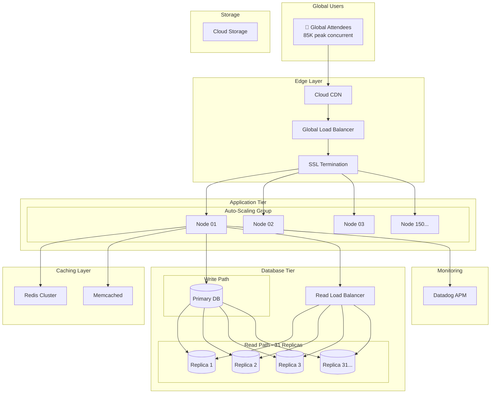
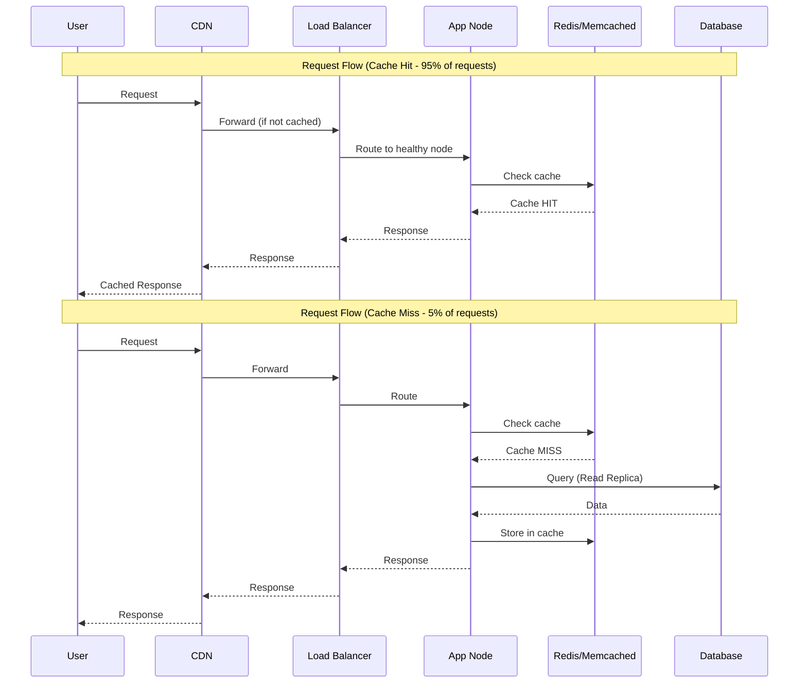
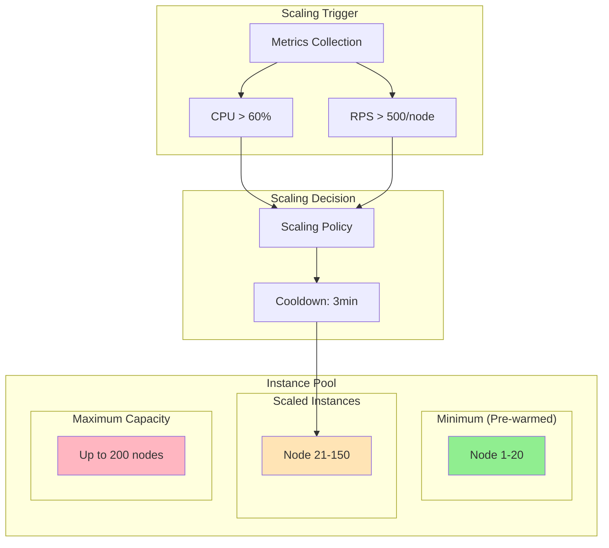
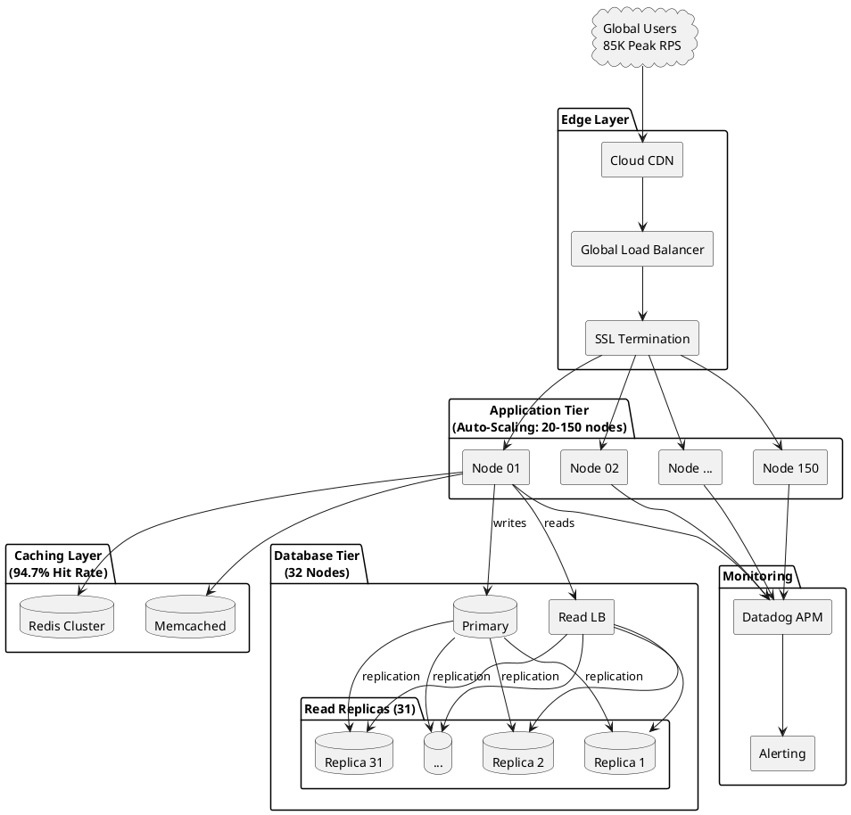
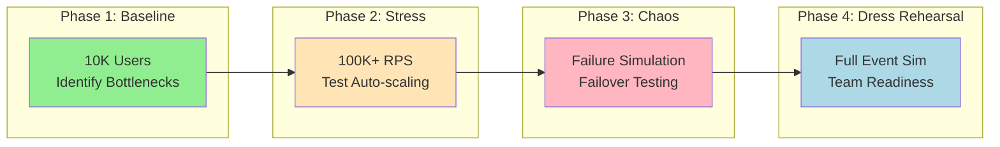

# High-Scale Event Platform (Cisco Live) - Architecture Diagram

## Mermaid Diagram - Overall Architecture



---

## Traffic Flow Diagram



---

## Auto-Scaling Architecture



---

## PlantUML Diagram



---

## Load Testing Progression



---

## Datadog Monitoring Dashboard Layout

```
┌─────────────────────────────────────────────────────────────────────────────┐
│                      CISCO LIVE - REAL-TIME DASHBOARD                        │
├─────────────────────────────────────────────────────────────────────────────┤
│                                                                              │
│  ┌──────────────────────┐  ┌──────────────────────┐  ┌──────────────────────┐│
│  │   REQUEST RATE       │  │   ERROR RATE         │  │   LATENCY P99        ││
│  │   ━━━━━━━━━━━        │  │   ━━━━━━━━━━━        │  │   ━━━━━━━━━━━        ││
│  │   85,234 req/s       │  │   0.02%              │  │   142ms              ││
│  │   ▲ 12% from avg     │  │   ✓ Below threshold  │  │   ✓ Below 200ms      ││
│  └──────────────────────┘  └──────────────────────┘  └──────────────────────┘│
│                                                                              │
│  ┌──────────────────────┐  ┌──────────────────────┐  ┌──────────────────────┐│
│  │   ACTIVE NODES       │  │   CPU UTILIZATION    │  │   MEMORY USAGE       ││
│  │   ━━━━━━━━━━━        │  │   ━━━━━━━━━━━        │  │   ━━━━━━━━━━━        ││
│  │   147 / 200          │  │   68%                │  │   72%                ││
│  │   Auto-scaling ON    │  │   ▲ Scaling trigger  │  │   ✓ Healthy          ││
│  └──────────────────────┘  └──────────────────────┘  └──────────────────────┘│
│                                                                              │
│  ┌──────────────────────┐  ┌──────────────────────┐  ┌──────────────────────┐│
│  │   DB CONNECTIONS     │  │   CACHE HIT RATE     │  │   CDN BANDWIDTH      ││
│  │   ━━━━━━━━━━━        │  │   ━━━━━━━━━━━        │  │   ━━━━━━━━━━━        ││
│  │   2,412 active       │  │   94.7%              │  │   12.5 Gbps          ││
│  │   Pool: 80% used     │  │   ▲ Above target     │  │   ✓ Within capacity  ││
│  └──────────────────────┘  └──────────────────────┘  └──────────────────────┘│
│                                                                              │
│  ┌─────────────────────────────────────────────────────────────────────────┐│
│  │                    TRAFFIC OVER TIME (3-Day Event)                      ││
│  │                                                                         ││
│  │  RPS │                    ┌────┐                                        ││
│  │  80K │                  ┌─┘    └─┐                                      ││
│  │  60K │               ┌──┘        └──┐                                   ││
│  │  40K │    ┌─────────┘              └─────────┐                          ││
│  │  20K │ ───┘                                  └───                       ││
│  │      └───────────────────────────────────────────────────────────────   ││
│  │           Day 1         Day 2         Day 3                             ││
│  └─────────────────────────────────────────────────────────────────────────┘│
│                                                                              │
└─────────────────────────────────────────────────────────────────────────────┘
```

---

## Component Specifications

### Application Tier:
| Spec | Value |
|------|-------|
| Instance Type | n2-standard-8 (8 vCPU, 32GB) |
| Min Instances | 20 (pre-warmed) |
| Max Instances | 200 |
| Scale-up Trigger | CPU > 60% OR RPS > 500/node |
| Scale-down Trigger | CPU < 30% for 10 min |

### Database Tier:
| Spec | Value |
|------|-------|
| Primary | n2-highmem-32 (32 vCPU, 256GB) |
| Replicas | 31 x n2-highmem-16 |
| Connection Pool | 100 connections/app node |
| Read/Write Split | 95% reads, 5% writes |

### Caching Layer:
| Spec | Value |
|------|-------|
| Redis | 5-node cluster, 64GB each |
| Memcached | 10-node cluster, 32GB each |
| Hit Rate Target | > 90% |
| TTL | 5-15 minutes depending on data |
