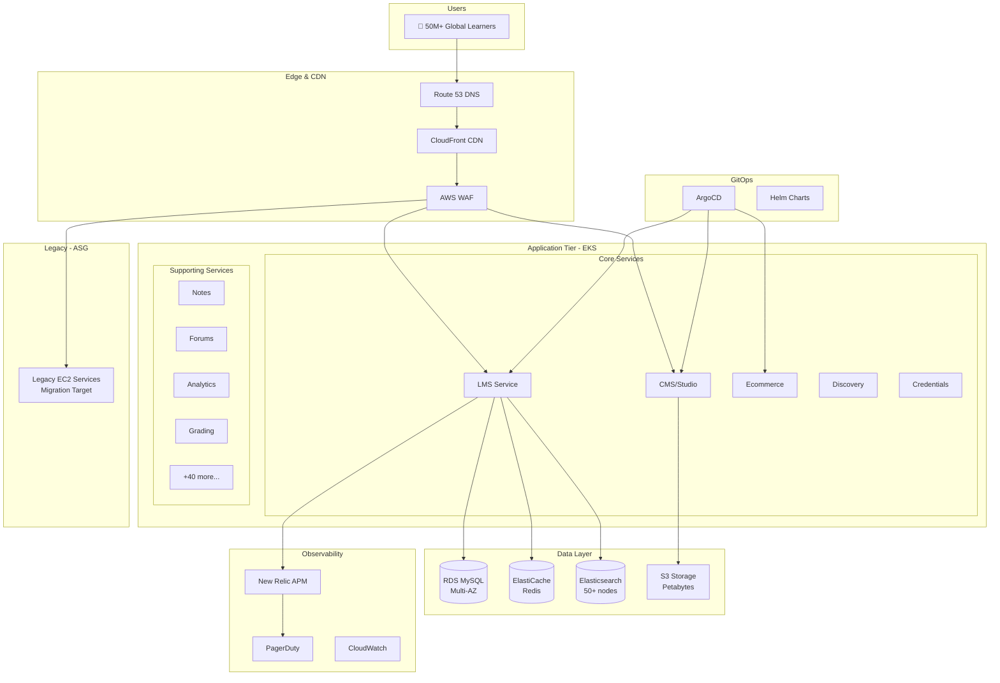
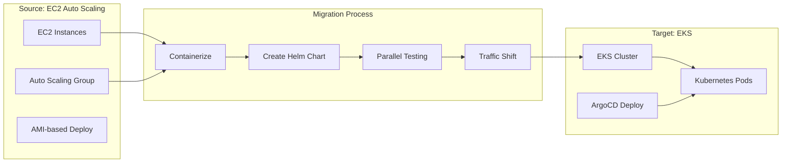
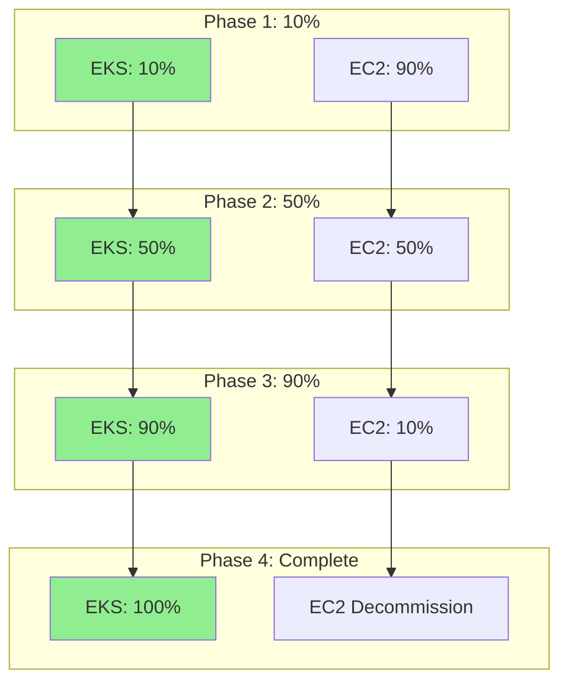
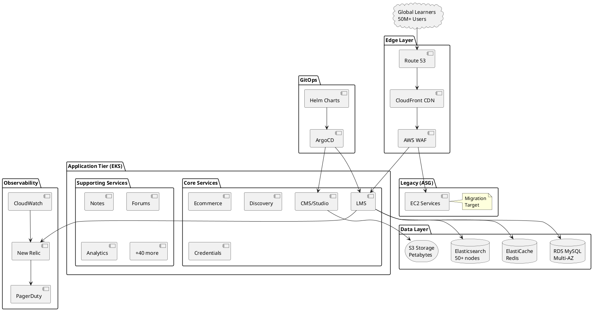
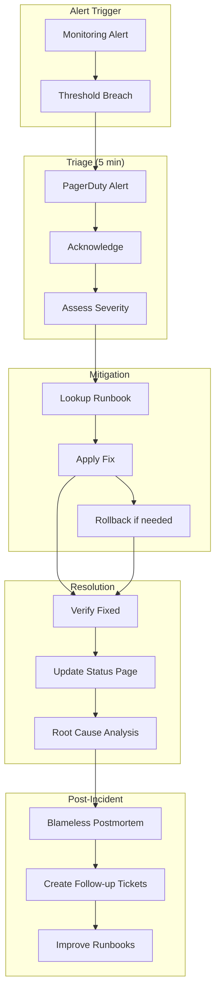
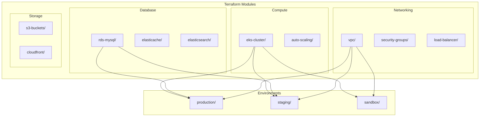

# edX Platform - SRE Architecture Diagram

## Mermaid Diagram - Overall Architecture



---

## Migration Architecture



---

## Traffic Shifting Strategy



---

## PlantUML Diagram



---

## On-Call Incident Response Flow



---

## Service Level Objectives Dashboard

```
┌─────────────────────────────────────────────────────────────────────────────┐
│                        edX SLO DASHBOARD                                     │
├─────────────────────────────────────────────────────────────────────────────┤
│                                                                              │
│  SERVICE         │ SLO TARGET │ CURRENT  │ ERROR BUDGET │ STATUS            │
│  ────────────────┼────────────┼──────────┼──────────────┼─────────────────  │
│  LMS Availability│   99.9%    │  99.94%  │  72% remain  │  ✅ Healthy       │
│  API Latency P99 │   <500ms   │   342ms  │     N/A      │  ✅ Healthy       │
│  Video Delivery  │   99.95%   │  99.97%  │  84% remain  │  ✅ Healthy       │
│  Authentication  │   99.99%   │  99.995% │  95% remain  │  ✅ Healthy       │
│  Course Enrollment│  99.9%    │  99.87%  │  43% remain  │  ⚠️ Warning       │
│  ────────────────┴────────────┴──────────┴──────────────┴─────────────────  │
│                                                                              │
│  ┌─────────────────────────────────────────────────────────────────────────┐│
│  │                    ERROR BUDGET BURNDOWN (30 days)                      ││
│  │                                                                         ││
│  │  100% │ ─────────────────────────────────────────────────────────────   ││
│  │       │ ╲                                                               ││
│  │   75% │  ╲────────────────────────────────────────────────────────      ││
│  │       │                                         ╲                       ││
│  │   50% │                                          ╲────────────────      ││
│  │       │                                                   ╲             ││
│  │   25% │                                                    ╲────────    ││
│  │       │                                                                 ││
│  │    0% └─────────────────────────────────────────────────────────────    ││
│  │         Day 1                                              Day 30       ││
│  └─────────────────────────────────────────────────────────────────────────┘│
│                                                                              │
└─────────────────────────────────────────────────────────────────────────────┘
```

---

## Terraform Module Structure



---

## Component Specifications

### EKS Cluster:
| Spec | Value |
|------|-------|
| Node Groups | 3 (general, compute, memory) |
| General Nodes | m5.2xlarge x 20 |
| Compute Nodes | c5.4xlarge x 10 |
| Memory Nodes | r5.2xlarge x 10 |
| Total Pods | 500+ running |

### Database Layer:
| Service | Spec |
|---------|------|
| RDS MySQL | db.r5.4xlarge, Multi-AZ |
| ElastiCache | cache.r5.2xlarge, 6 nodes |
| Elasticsearch | 50+ nodes, i3.2xlarge |

### Microservices:
| Category | Count |
|----------|-------|
| Core Services | 5 |
| Supporting Services | 45+ |
| Background Workers | 20+ |
| Scheduled Jobs | 30+ |
