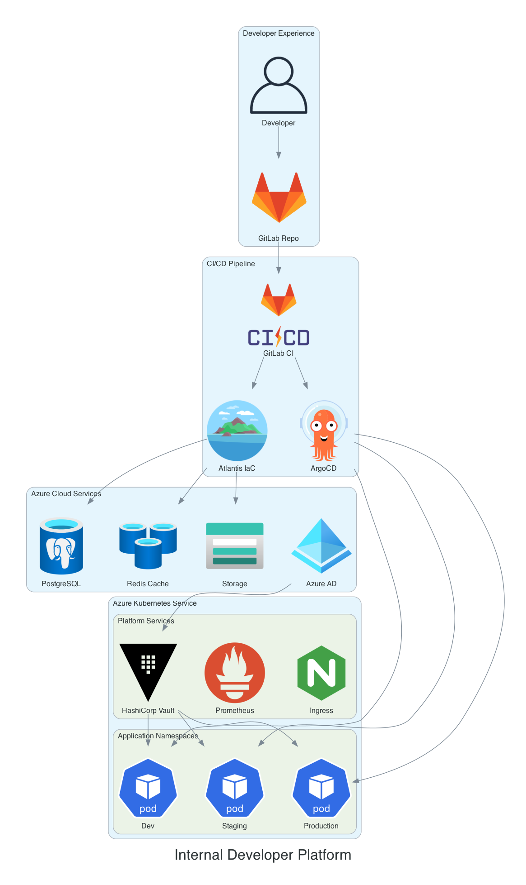
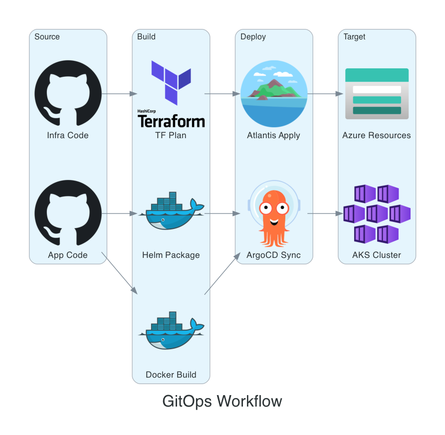
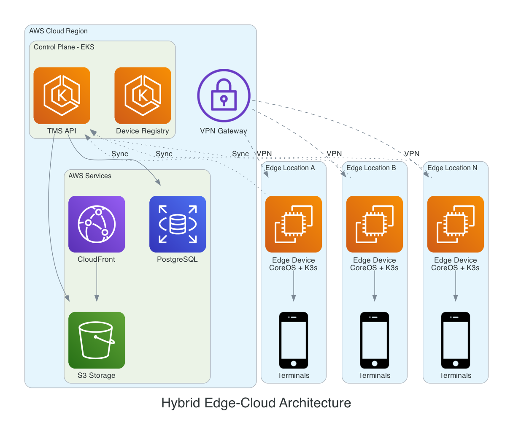
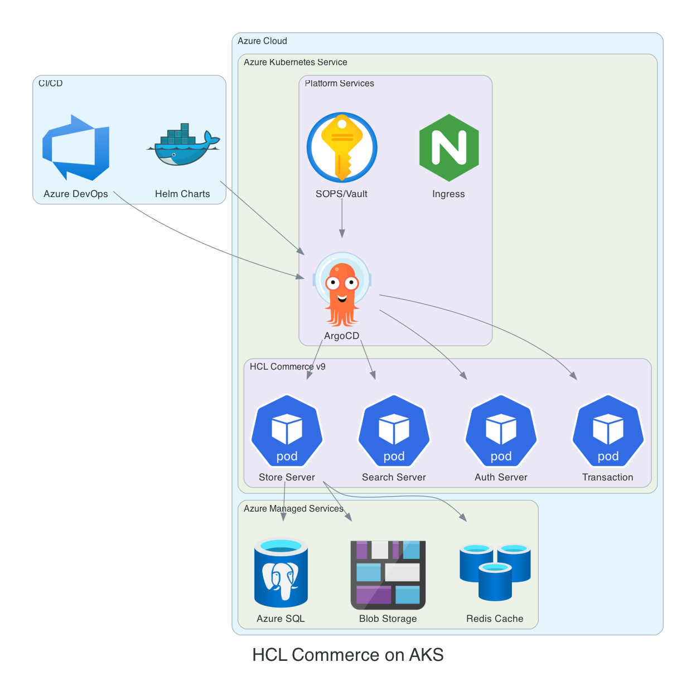
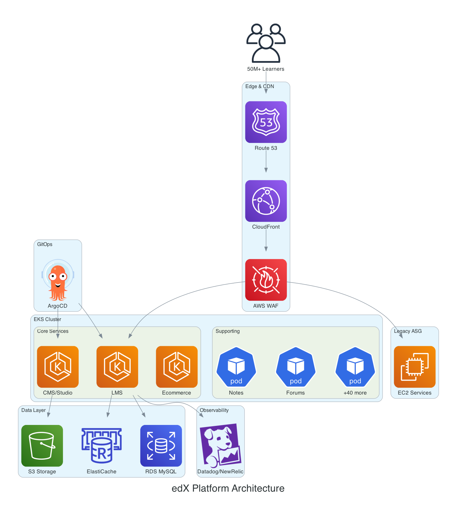
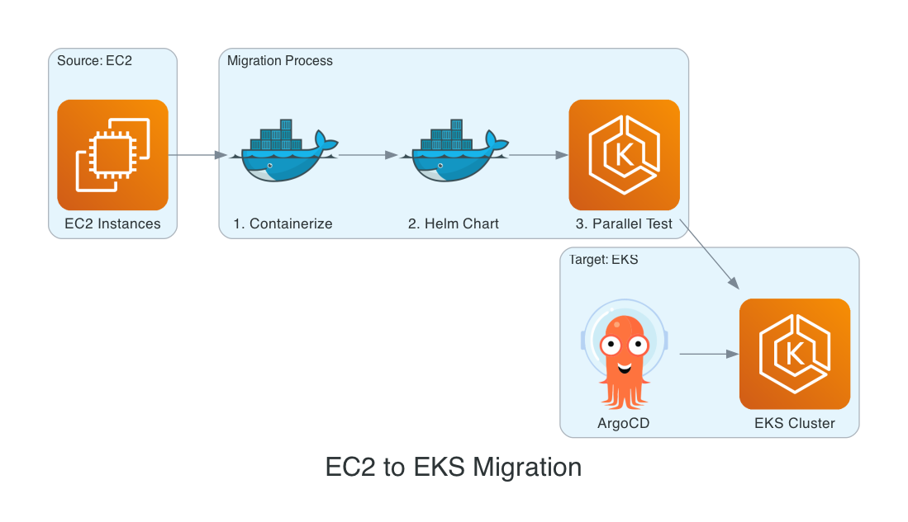
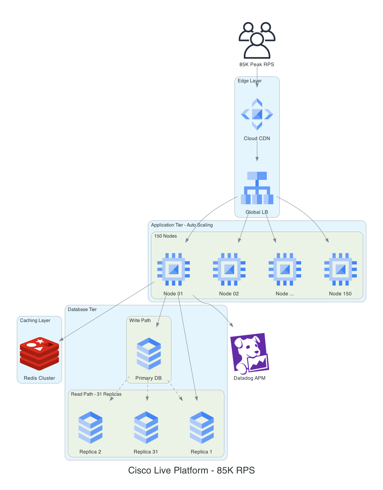
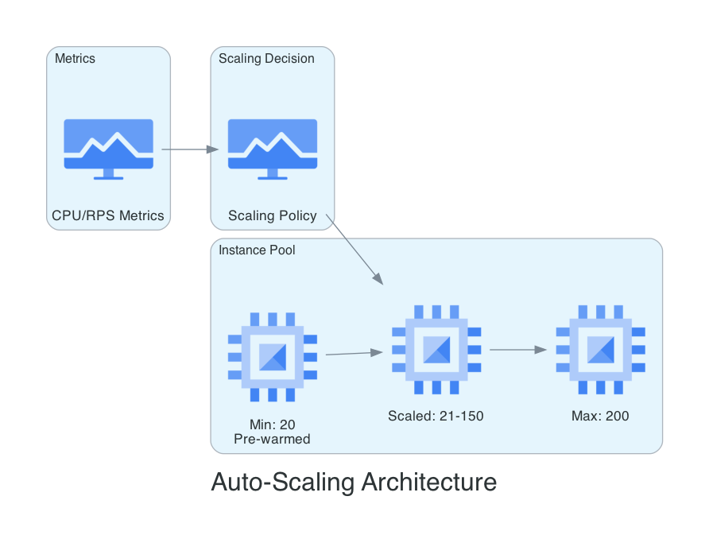

# Architecture Diagrams - Professional Cloud Icons

These diagrams were generated using the [diagrams](https://diagrams.mingrammer.com/) Python library with **official cloud provider icons** from AWS, Azure, GCP, and Kubernetes.

---

## 1. Internal Developer Platform (AERQ)

### Main Architecture


### GitOps Workflow


---

## 2. Hybrid Edge-Cloud Architecture (ChaiOne TMS)

### Main Architecture


---

## 3. HCL Commerce Kubernetes Migration (Parker/Redify)

### Main Architecture


### Blue-Green Deployment


---

## 4. edX Platform - SRE Architecture

### Main Architecture


### Migration Flow


---

## 5. Cisco Live - High-Scale Event Platform

### Main Architecture


### Auto-Scaling Architecture


---

## Regenerating Diagrams

To regenerate or modify these diagrams, run:

```bash
cd /Users/arbab.khalil/personal/public-docs/upwork-portfolios/diagrams
python generate_diagrams.py
```

### Requirements
- Python 3.8+
- `pip install diagrams`
- Graphviz (`brew install graphviz` on macOS)

### Customization
Edit `generate_diagrams.py` to:
- Add new components
- Change colors/themes
- Modify layout direction
- Add more cloud services
