# All Architecture Diagrams - Mermaid.js

> **How to Export:** Copy each diagram code block to [mermaid.live](https://mermaid.live) and export as PNG/SVG

---

## 1. Internal Developer Platform (AERQ)

### Main Architecture


### GitOps Workflow

```mermaid
flowchart LR
    subgraph SOURCE["📁 Source"]
        CODE[Application Code]
        INFRA[Infrastructure Code]
    end

    subgraph BUILD["🔨 Build"]
        DOCKER[Build Docker Image]
        HELM[Package Helm Chart]
        TF[Terraform Plan]
    end

    subgraph DEPLOY["🚀 Deploy"]
        ECR[Push to Registry]
        ARGO[ArgoCD Sync]
        APPLY[Atlantis Apply]
    end

    subgraph TARGET["🎯 Target"]
        K8S[Kubernetes Cluster]
        CLOUD[Azure Resources]
    end

    CODE --> DOCKER --> ECR --> ARGO --> K8S
    CODE --> HELM --> ARGO
    INFRA --> TF --> APPLY --> CLOUD

    style SOURCE fill:#e3f2fd,stroke:#1976d2
    style BUILD fill:#fff3e0,stroke:#f57c00
    style DEPLOY fill:#e8f5e9,stroke:#388e3c
    style TARGET fill:#f3e5f5,stroke:#7b1fa2
```



---

## 2. Hybrid Edge-Cloud Architecture (ChaiOne TMS)

### Main Architecture



```mermaid
flowchart TB
    subgraph AWS["☁️ AWS Cloud Region"]
        subgraph EKS["Control Plane - EKS"]
            API[TMS API Gateway]
            ANALYTICS[Analytics Service]
            REGISTRY[Device Registry]
            CONFIG[Config Manager]
        end
        
        subgraph SERVICES["AWS Services"]
            CF[CloudFront CDN]
            S3[(S3 Storage)]
            RDS[(RDS PostgreSQL)]
            ECR[ECR Registry]
        end
        
        VPN[🔐 VPN Gateway]
    end

    subgraph EDGE_A["🏭 Edge Location A"]
        subgraph DEVICE_A["Edge Device - CoreOS"]
            K3S_A[K3s Cluster]
            AGENT_A[TMS Agent]
            DB_A[(SQLite)]
        end
        TERM_A[🖥️ Terminals]
    end

    subgraph EDGE_B["🏭 Edge Location B"]
        subgraph DEVICE_B["Edge Device - CoreOS"]
            K3S_B[K3s Cluster]
            AGENT_B[TMS Agent]
            DB_B[(SQLite)]
        end
        TERM_B[🖥️ Terminals]
    end

    subgraph EDGE_N["🏭 Edge Location N"]
        subgraph DEVICE_N["Edge Device - CoreOS"]
            K3S_N[K3s Cluster]
            AGENT_N[TMS Agent]
            DB_N[(SQLite)]
        end
        TERM_N[🖥️ Terminals]
    end

    API --> RDS
    API --> S3
    CF --> S3
    
    VPN -.->|Site-to-Site VPN| K3S_A
    VPN -.->|Site-to-Site VPN| K3S_B
    VPN -.->|Site-to-Site VPN| K3S_N
    
    AGENT_A --> DB_A
    AGENT_B --> DB_B
    AGENT_N --> DB_N
    
    K3S_A --> TERM_A
    K3S_B --> TERM_B
    K3S_N --> TERM_N
    
    AGENT_A -.->|Sync| API
    AGENT_B -.->|Sync| API
    AGENT_N -.->|Sync| API

    style AWS fill:#fff3e0,stroke:#f57c00
    style EKS fill:#e3f2fd,stroke:#1976d2
    style SERVICES fill:#e8f5e9,stroke:#388e3c
    style EDGE_A fill:#f3e5f5,stroke:#7b1fa2
    style EDGE_B fill:#f3e5f5,stroke:#7b1fa2
    style EDGE_N fill:#f3e5f5,stroke:#7b1fa2
```

### Offline-First Data Flow

```mermaid
sequenceDiagram
    participant T as 🖥️ Terminal
    participant E as 📦 Edge Agent
    participant L as 💾 Local DB
    participant V as 🔐 VPN
    participant C as ☁️ Cloud API
    participant D as 🗄️ Cloud DB

    Note over T,D: ✅ Normal Operation (Connected)
    T->>E: Transaction Request
    E->>L: Store Locally
    E->>V: Sync Request
    V->>C: Forward
    C->>D: Persist
    C-->>E: ✓ Confirmed
    E-->>T: ✓ Complete

    Note over T,D: ⚠️ Offline Operation
    T->>E: Transaction Request
    E->>L: Store Locally
    E-->>T: ✓ Queued

    Note over T,D: 🔄 Reconnection & Sync
    V->>E: Connection Restored
    E->>L: Get Queued Items
    E->>V: Batch Sync
    V->>C: Forward Batch
    C->>D: Persist All
    C-->>E: ✓ Sync Complete
```



---

## 3. HCL Commerce Kubernetes Migration (Parker/Redify)

### Main Architecture


### Blue-Green Deployment

```mermaid
flowchart LR
    subgraph BEFORE["Before Deployment"]
        B_BLUE[🔵 v1.0.0<br/>ACTIVE]
        B_SVC[Active Service]
        B_TRAFFIC[100% Traffic]
    end

    subgraph DURING["During Deployment"]
        D_BLUE[🔵 v1.0.0<br/>Active]
        D_GREEN[🟢 v1.1.0<br/>Preview]
        D_ASVC[Active Svc]
        D_PSVC[Preview Svc]
    end

    subgraph AFTER["After Promotion"]
        A_BLUE[🔵 v1.0.0<br/>Standby]
        A_GREEN[🟢 v1.1.0<br/>ACTIVE]
        A_SVC[Active Service]
    end

    B_TRAFFIC --> B_SVC --> B_BLUE
    D_ASVC --> D_BLUE
    D_PSVC --> D_GREEN
    A_SVC --> A_GREEN

    BEFORE --> DURING --> AFTER

    style B_BLUE fill:#bbdefb,stroke:#1976d2
    style D_BLUE fill:#bbdefb,stroke:#1976d2
    style D_GREEN fill:#c8e6c9,stroke:#388e3c
    style A_BLUE fill:#e3f2fd,stroke:#90caf9
    style A_GREEN fill:#c8e6c9,stroke:#388e3c
```



### Custom ArgoCD Plugin Flow


---

## 4. edX Platform - SRE Architecture

### Main Architecture



```mermaid
flowchart TB
    subgraph USERS["👥 Users"]
        LEARNERS[50M+ Global Learners]
    end

    subgraph EDGE["🌐 Edge & CDN"]
        R53[Route 53]
        CF[CloudFront]
        WAF[AWS WAF]
    end

    subgraph EKS["☸️ EKS Cluster"]
        subgraph CORE["Core Services"]
            LMS[LMS]
            CMS[CMS/Studio]
            ECOMM[Ecommerce]
            DISC[Discovery]
            CRED[Credentials]
        end
        
        subgraph SUPPORT["Supporting Services"]
            NOTES[Notes]
            FORUMS[Forums]
            ANALYTICS[Analytics]
            MORE[+40 more...]
        end
    end

    subgraph LEGACY["🖥️ Legacy - ASG"]
        EC2[EC2 Services<br/>Migration Target]
    end

    subgraph DATA["💾 Data Layer"]
        RDS[(RDS MySQL)]
        REDIS[(ElastiCache)]
        ES[(Elasticsearch)]
        S3[(S3 Storage)]
    end

    subgraph GITOPS["🔄 GitOps"]
        ARGO[ArgoCD]
        HELM[Helm Charts]
    end

    subgraph OBS["📊 Observability"]
        NR[New Relic]
        PD[PagerDuty]
    end

    LEARNERS --> R53 --> CF --> WAF
    WAF --> LMS
    WAF --> EC2
    
    LMS --> RDS
    LMS --> REDIS
    LMS --> ES
    CMS --> S3
    
    ARGO --> LMS
    ARGO --> CMS
    
    LMS --> NR --> PD

    style USERS fill:#e3f2fd,stroke:#1976d2
    style EDGE fill:#fff3e0,stroke:#f57c00
    style EKS fill:#e8f5e9,stroke:#388e3c
    style LEGACY fill:#ffebee,stroke:#d32f2f
    style DATA fill:#f3e5f5,stroke:#7b1fa2
    style GITOPS fill:#e0f2f1,stroke:#00897b
    style OBS fill:#fff8e1,stroke:#ffa000
```

### Migration Flow

```mermaid
flowchart LR
    subgraph SOURCE["🖥️ Source: EC2"]
        EC2[EC2 Instances]
        ASG[Auto Scaling]
        AMI[AMI Deploy]
    end

    subgraph PROCESS["🔄 Migration"]
        DOCKER[1. Containerize]
        HELM[2. Helm Chart]
        TEST[3. Parallel Test]
        SHIFT[4. Traffic Shift]
    end

    subgraph TARGET["☸️ Target: EKS"]
        EKS[EKS Cluster]
        PODS[K8s Pods]
        ARGO[ArgoCD]
    end

    EC2 --> DOCKER --> HELM --> TEST --> SHIFT --> EKS
    ARGO --> PODS

    style SOURCE fill:#ffebee,stroke:#d32f2f
    style PROCESS fill:#fff3e0,stroke:#f57c00
    style TARGET fill:#e8f5e9,stroke:#388e3c
```



### On-Call Incident Flow


---

## 5. Cisco Live - High-Scale Event Platform

### Main Architecture


### Auto-Scaling Flow

```mermaid
flowchart LR
    subgraph METRICS["📊 Metrics"]
        CPU[CPU > 60%]
        RPS[RPS > 500/node]
    end

    subgraph DECISION["🧠 Scaling Decision"]
        POLICY[Scaling Policy]
        COOLDOWN[Cooldown: 3 min]
    end

    subgraph POOL["🖥️ Instance Pool"]
        MIN["🟢 Min: 20 nodes<br/>Pre-warmed"]
        SCALED["🟡 Scaled: 21-150<br/>On-demand"]
        MAX["🔴 Max: 200<br/>Capacity"]
    end

    CPU --> POLICY
    RPS --> POLICY
    POLICY --> COOLDOWN --> SCALED

    style METRICS fill:#fff3e0,stroke:#f57c00
    style DECISION fill:#e3f2fd,stroke:#1976d2
    style MIN fill:#c8e6c9,stroke:#388e3c
    style SCALED fill:#fff9c4,stroke:#fbc02d
    style MAX fill:#ffcdd2,stroke:#e53935
```



### Traffic Pattern During Event


### Database Architecture


---

## Quick Reference: Export Instructions

1. **Go to:** [mermaid.live](https://mermaid.live)
2. **Copy** the code between ` ```mermaid ` and ` ``` `
3. **Paste** into the editor
4. **Export** using the download button (PNG or SVG)

### Recommended Export Settings:
- **Format:** PNG (for Upwork) or SVG (for scaling)
- **Background:** White
- **Scale:** 2x for high resolution
